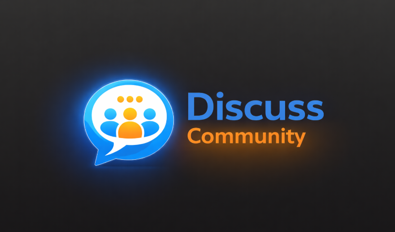
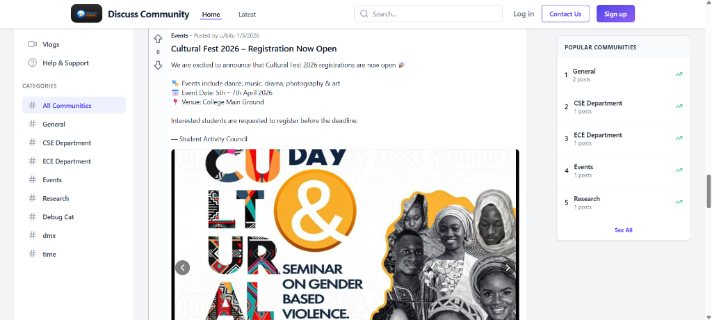
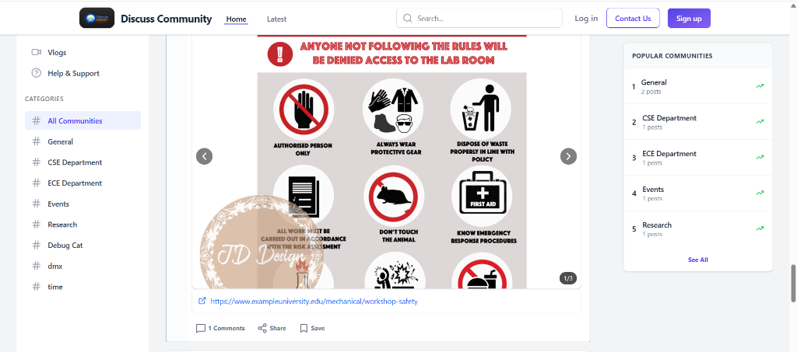
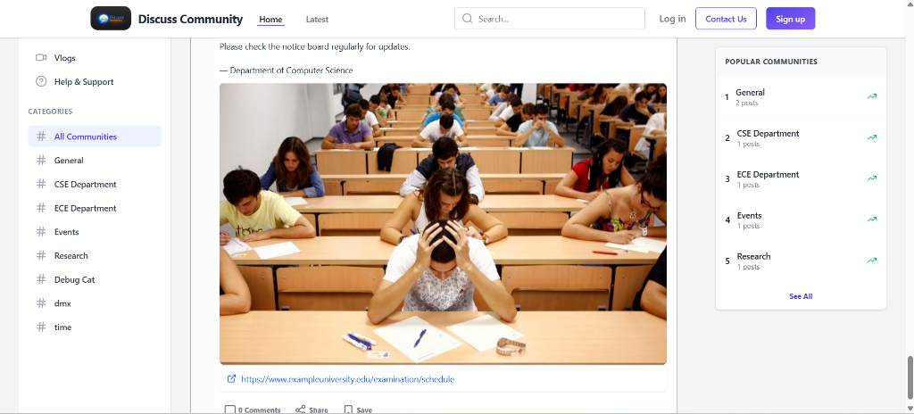

# Discuss Community Platform



## Overview
Discuss Community is a modern web application designed to facilitate discussions, verify community members, and share knowledge. It features a robust backend built with Django and a dynamic frontend powered by React.

## 🛠 Tech Stack

### Frontend
-   **Framework**: React (Vite)
-   **State Management**: Redux Toolkit
-   **Styling**: Tailwind CSS, Lucide React (Icons)
-   **Routing**: React Router DOM (v7)

### Backend
-   **Framework**: Django, Django REST Framework (DRF)
-   **Authentication**: JWT (Simple JWT)
-   **Database**: SQLite (Development), PostgreSQL (Production ready)
-   **CORS**: Django CORS Headers

## 🚀 Getting Started

Follow these instructions to set up the project locally.

### Prerequisites
-   [Node.js](https://nodejs.org/) (v16+)
-   [Python](https://www.python.org/) (v3.10+)
-   [Git](https://git-scm.com/)

### Installation

1.  **Clone the repository**
    ```bash
    git clone <YOUR_REPO_URL>
    cd dmx-project
    ```

2.  **Backend Setup**
    Navigate to the backend directory and set up the Python environment.
    ```bash
    cd backend
    
    # Create a virtual environment (optional but recommended)
    python -m venv venv
    
    # Activate virtual environment
    # On Windows:
    .\venv\Scripts\activate
    # On macOS/Linux:
    source venv/bin/activate
    
    # Install dependencies
    pip install -r requirements.txt
    
    # Apply migrations
    python manage.py migrate
    
    # Start the server
    python manage.py runserver
    ```
    The backend will run at `http://localhost:8000`.

3.  **Frontend Setup**
    Open a new terminal, navigate to the frontend directory, and install dependencies.
    ```bash
    cd frontend
    
    # Install dependencies
    npm install
    
    # Start the development server
    npm run dev
    ```
    The frontend will run at `http://localhost:5173` (or the port shown in your terminal).

## 📂 Project Structure

```
dmx-project/
├── backend/            # Django Backend
│   ├── config/         # Project configuration
│   ├── community/      # Community app (Posts, Comments)
│   ├── users/          # Users app (Auth, Profiles)
│   ├── manage.py       # Django management script
│   └── requirements.txt
│
├── frontend/           # React Frontend
│   ├── src/
│   │   ├── components/ # Reusable components
│   │   ├── features/   # Redux slices
│   │   ├── pages/      # Application pages
│   │   └── assets/     # Images and static files
│   └── package.json
│
└── README.md
```

## ✨ Features
-   **User Authentication**: Sign up, Login, and Role-based access (Student, Faculty, etc.).
-   **Posts & Discussions**: Create, read, update, and delete posts.
-   **Community Verification**: Faculty verification system.
-   **Responsive Design**: Mobile-friendly interface with Tailwind CSS.

## 📸 Screenshots

<!-- Add screenshots of your application here -->





## 🤝 Contributing
1.  Fork the repository.
2.  Create a new branch (`git checkout -b feature/NewFeature`).
3.  Commit your changes (`git commit -m 'Add some NewFeature'`).
4.  Push to the branch (`git push origin feature/NewFeature`).
5.  Open a Pull Request.

